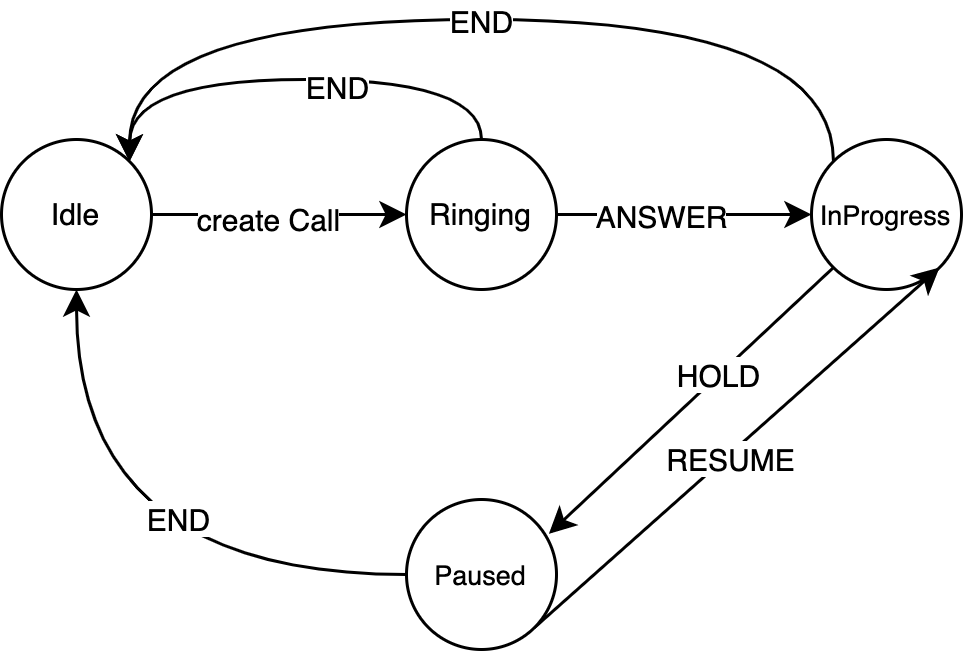

Да се имплементира апликација за евидентирање на повиците помеѓу телефонските броеви на ниво на еден телекомуникациски оператор.

Да се имплементира класата TelcoApp со следните методи:

- void addCall (String uuid, String dialer, String receiver, long timestamp) - телефонскиот број dialer го повикува телефонскиот број receiver во времето timestamp.
- void updateCall (String uuid, long timestamp, String action) - метод за ажурирање на веќе иницијализиран телефонски повик од бројот dialer кон бројот receiver во времето timestamp со некоја од следните акции:
  - ANSWER (receiver одговорил на повикот од dialer)
  - END (некој од двајцата соговорници го прекинал повикот)
  - HOLD (некој од двајцата соговорници го ставил повикот на чекање)
  - RESUME (повикот продолжил откако претходно бил ставен на чекање)
- void printChronologicalReport(String phoneNumber) - печати извештај на сите повици во кои е вклучен бројот phoneNumber сортирани според почетокот на телефонскиот повик. Форматот на печатење е R/D other_number start end MM:SS каде што R се печати доколку телефонскиот број е повикан во конкретниот повикот, а D доколку телефонскиот број е повикувач во повикот, number е телефонскиот број од другата страна на повикот, start е почетокот на повикот (времето кога повиканиот одговорил), end е крајот на повикот (кога некој од двајцата соговорници го прекинал разговорот), а MM:SS е времетраењето на повикот во минути и секунди. Во времетраењето на разговорот да не се сметаaт интервалите поминати во чекање (помеѓу HOLD и RESUME). Доколку станува збор за пропуштен повик (receiver не одговорил), наместо времето end да се испечати MISSED CALL. Времетраењето на пропуштените повици е секогаш 00:00.
- void printReportByDuration(String phoneNumber) - печати извештај за сите повици во кои е вклучен бројот phoneNumber сортирани според времетраењето на повикот во опаѓачки редослед. Форматот на печатење е ист како и во претходниот метод.
- void printCallsDuration() - печати извештај за вкупното времетраење на сите разговори помеѓу сите парови на телефонски броеви. Напомена: Кога А го повикува B е различен пар од кога B го повикува А.
  
На дијаграмот на машината на состојба подоле се прикажани сите можни состојби на еден повик, како и акциите со кои се преминува од една во друга состојба. Во тест примерите се употребуваат само валидни акции за премини од една во друга состојба (нема тест примери во која се применува на пример акцијата ANSWER во состојба Paused).

